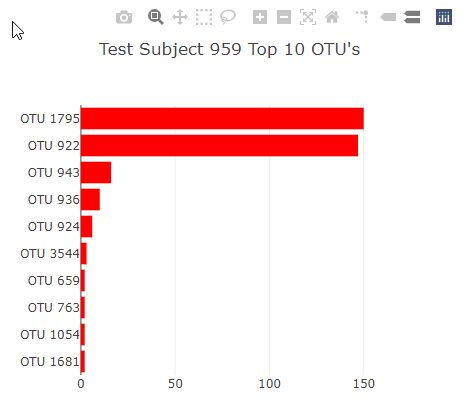
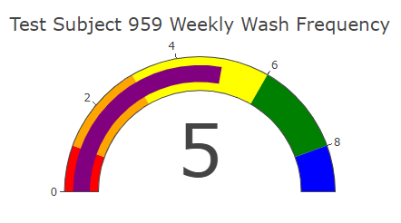
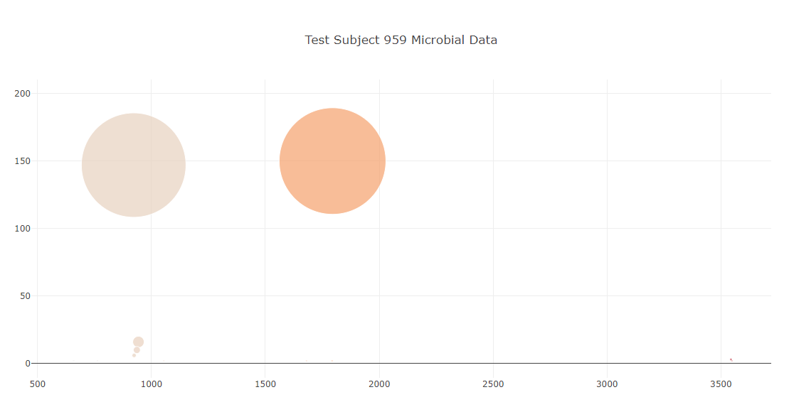
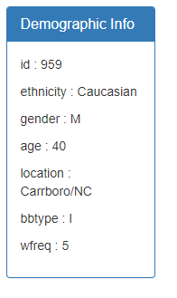

# plotly-challenge
This homework assignment required me to utilize a JSON file of data to dyanamically update the following: 

- Dropdown Menu
- Plotly Bar Chart
- Plotly Gauge Chart
- Plotly Bubble Chart
- Test Subject Demographic Information

In addition to requirements, I added a dynamic title to all charts that populations the test subject's ID in the title. 

The page was then deployed to GitHub pages at: [https://jonrsmart.github.io/plotly-challenge/]
