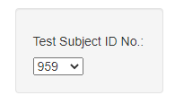

# plotly-challenge
This homework assignment required me to utilize a JSON file of data to dyanamically update the following: 
- Dropdown Menu

- Plotly Bar Chart

- Plotly Gauge Chart

- Plotly Bubble Chart

- Test Subject Demographic Information

In addition to requirements, I added a dynamic title to all charts that populations the test subject's ID in the title. 

The page was then deployed to GitHub pages at: [https://jonrsmart.github.io/plotly-challenge/]
